# Архитектура

Документ описывает устройство системы: из каких частей она состоит, как они взаимодействуют и где хранятся данные.

## 1. Компоненты

```
 браузер ──HTTPS/WSS──► nginx (SPA, CSP, прокси /api и /ws)
                            │
                            ▼
                    backend (profile backend) ──► PostgreSQL 17
                    REST и STOMP-сервер             Redis 8
                            │                       MinIO (S3-совместимое хранилище)
                            │
   worker (profile worker) ─┘  очередь заданий, outbox, обработка медиа,
                               очистка данных; без HTTP-API
```

- **Фронтенд** — одностраничное приложение на Angular. Раздаётся nginx, который проксирует `/api/` и `/ws` к backend. Заголовки безопасности и Content-Security-Policy заданы в nginx.
- **backend** — один процесс Spring Boot с профилем `backend`. Принимает REST-запросы и подключения STOMP.
- **worker** — тот же образ с профилем `worker`. Выполняет фоновые задания и доставляет события из outbox. HTTP-интерфейса нет.
- **PostgreSQL** — основное хранилище. Схема ведётся миграциями Flyway (`backend/src/main/resources/db/migration`), приложение работает с ней в режиме `ddl-auto: validate`.
- **Redis** — кэш публичных полей, ограничители частоты, краткоживущее состояние (например, признак набора текста) и сигнал для relay outbox о новых событиях. Источник истины — PostgreSQL: потеря данных Redis не приводит к потере пользовательских данных.
- **MinIO** — объекты: исходные файлы, варианты превью, вложения. Доступ через AWS SDK v2.

Внутренняя сеть Docker (`private`) не имеет выхода наружу: PostgreSQL, Redis, MinIO и миграции доступны только контейнерам приложения. Во внешнюю сеть выходят backend и worker — для Google OIDC и SMTP.

## 2. Модули backend

Код разделён по предметным пакетам. Зависимости идут от прикладных модулей к `platform`, а не наоборот.

| Пакет | Назначение |
|---|---|
| `identity` | учётные записи, роли, сессии (access JWT и refresh), восстановление пароля, подтверждение почты, вход через Google, журнал аудита |
| `profiles` | публичные и собственные профили, аватар и обложка |
| `social` | подписки и блокировки |
| `content` | записи, черновики, отложенная публикация, комментарии, реакции, хештеги |
| `media` | загрузка, проверка типа и размера, обработка изображений, связи с записями, сообщениями и профилями, выдача ссылок |
| `messaging` | личные и групповые беседы, сообщения, правка и удаление, журнал событий беседы, вложения, прочтение, приглашения |
| `communities` | сообщества, роли, заявки на вступление, приглашения |
| `notifications` | уведомления и настройки по категориям |
| `moderation` | жалобы, очередь модерации, доказательства |
| `sanctions` | временные и постоянные санкции аккаунтов |
| `admin` | управление пользователями и ролями, агрегированная статистика |
| `settings` | настройки приложения (например, открытость регистрации) |
| `search` | поиск пользователей, записей, сообществ и хештегов |
| `retention` | очистка устаревших данных и неиспользуемых медиа |
| `demo` | демонстрационные данные (только явно включённый профиль) |
| `platform` | сквозные части: веб-настройка, безопасность, STOMP, фоновые задания, outbox, кэш, ограничители, идемпотентность, почта, проверки здоровья |

## 3. Основные потоки

### Публикация и уведомления

Изменение записывается в PostgreSQL в одной транзакции вместе с строкой `outbox_events`. Relay в worker читает outbox и помечает доставку в `outbox_deliveries`. Потребители создают уведомления и отправляют realtime-события. Так событие не теряется, даже если доставка временно недоступна: доставка повторяется.

### Фоновые задания

Задания хранятся в таблице `background_jobs`. Worker забирает их с блокировкой строки, выполняет обработчик, при ошибке повторяет с ограничением попыток. Метрики очереди доступны на служебном порту.

### Медиа

1. Клиент запрашивает загрузку; сервер создаёт резервацию (`media_reservations`) с ограничениями по назначению (аватар, обложка, изображение записи, вложение чата, документ) и лимитами размера и типа.
2. Файл загружается в MinIO. Worker строит варианты (`media_variants`) и проверяет изображения, в том числе по размеру в пикселях.
3. Связь с записью, сообщением или профилем создаётся отдельно (`media_links`, `post_media`, `message_media`). Объект без связей удаляется очисткой.

### Сообщения

Каждое изменение беседы пишется в журнал `conversation_events` с номером `seq`. Клиент получает события через STOMP и при разрыве догоняет пропуски по журналу (см. [api.md](api.md)). Правка и удаление не меняют порядок сообщений и номера `seq`.

### Аудит и неизменяемость

Журнал `audit_logs` защищён триггером: строки нельзя изменить или удалить. Исключение — очистка по сроку хранения, которая выполняется отдельной функцией с явным разрешением в сессии.

### Очистка

Раз в час worker удаляет устаревшие данные по срокам хранения и неиспользуемые медиа. Удаление объекта в MinIO выполняется до удаления строк, а проверка «объект ещё не нужен» — в той же транзакции.

## 4. Безопасность

- **Аутентификация:** короткоживущий access JWT в заголовке `Authorization`; обновление через refresh-токен в cookie, привязанный к сессии. Сессии хранятся в `auth_sessions`. Завершение сессии или смена пароля отзывают её, а STOMP-соединения этой сессии закрываются.
- **Авторизация:** роли платформы (`USER`, `MODERATOR`, `ADMIN`) и роли в сообществах и беседах (`OWNER`, `ADMIN`, `MEMBER`). Проверки выполняются на сервере; интерфейс только скрывает недоступные разделы.
- **Защита от повторов:** для отдельных операций создания нужен заголовок `Idempotency-Key`; повтор с тем же ключом возвращает результат первого запроса (`idempotency_records`).
- **Ограничение частоты:** счётчики в Redis.
- **Заголовки:** Content-Security-Policy, `X-Content-Type-Options`, `X-Frame-Options`, HSTS (за HTTPS). Политика одинакова для API и статики.
- **Секреты:** только в переменных окружения. В репозитории нет паролей и ключей.

## 5. Схема данных

Схема построена из миграций `V1`–`V37`. Диаграмма содержит первичные ключи (PK), внешние ключи (FK) и связи; остальные колонки опущены.

```mermaid
erDiagram
    account_tokens {
        uuid id PK
        uuid user_id FK
    }
    app_settings {
        varchar key PK
        uuid updated_by FK
    }
    audit_logs {
        uuid id PK
        uuid actor_id FK
    }
    auth_sessions {
        uuid id PK
        uuid user_id FK
    }
    background_jobs {
        uuid id PK
    }
    comment_reactions {
        uuid comment_id PK
        uuid user_id PK
    }
    comments {
        uuid id PK
        uuid post_id FK
        uuid author_id FK
        uuid parent_id FK
        uuid reply_to_user_id FK
    }
    conversation_events {
        uuid id PK
        uuid conversation_id FK
        uuid actor_id FK
        uuid subject_user_id FK
        uuid message_id FK
    }
    conversation_invitations {
        uuid id PK
        uuid conversation_id FK
        uuid inviter_id FK
        uuid invitee_id FK
    }
    conversation_memberships {
        uuid id PK
        uuid conversation_id FK
        uuid user_id FK
    }
    conversations {
        uuid id PK
        uuid owner_id FK
        uuid avatar_media_id FK
    }
    direct_conversations {
        uuid conversation_id PK
        uuid user_low_id FK
        uuid user_high_id FK
    }
    external_identities {
        uuid id PK
        uuid user_id FK
    }
    flyway_schema_history {
        int installed_rank PK
    }
    follows {
        uuid follower_id PK
        uuid followee_id PK
    }
    group_invitations {
        uuid id PK
        uuid group_id FK
        uuid inviter_id FK
        uuid invitee_id FK
    }
    group_join_requests {
        uuid id PK
        uuid group_id FK
        uuid requester_id FK
        uuid decided_by FK
    }
    group_members {
        uuid group_id PK
        uuid user_id PK
    }
    groups {
        uuid id PK
        uuid owner_id FK
    }
    hashtags {
        uuid id PK
    }
    idempotency_records {
        uuid user_id PK
        varchar operation PK
        varchar key PK
    }
    media_assets {
        uuid id PK
        uuid owner_id FK
    }
    media_links {
        uuid media_id PK
        varchar link_type PK
        uuid link_id PK
    }
    media_reservations {
        uuid id PK
        uuid owner_id FK
    }
    media_variants {
        uuid id PK
        uuid media_id FK
    }
    message_audit {
        uuid id PK
        uuid message_id FK
        uuid conversation_id FK
        uuid actor_id FK
    }
    message_media {
        uuid message_id PK
        uuid media_id PK
    }
    messages {
        uuid id PK
        uuid conversation_id FK
        uuid sender_id FK
    }
    moderation_actions {
        uuid id PK
        uuid report_id FK
        uuid actor_id FK
    }
    notification_preferences {
        uuid user_id PK
        varchar type PK
    }
    notifications {
        uuid id PK
        uuid recipient_id FK
        uuid actor_id FK
        uuid report_id FK
    }
    outbox_deliveries {
        uuid event_id PK
        varchar consumer PK
    }
    outbox_events {
        uuid id PK
    }
    post_hashtags {
        uuid post_id PK
        uuid hashtag_id PK
    }
    post_media {
        uuid post_id PK
        uuid media_id PK
    }
    post_reactions {
        uuid post_id PK
        uuid user_id PK
    }
    posts {
        uuid id PK
        uuid author_id FK
        uuid group_id FK
    }
    refresh_tokens {
        uuid id PK
        uuid session_id FK
        uuid replaced_by_id FK
    }
    report_evidence {
        uuid id PK
        uuid report_id FK
    }
    reports {
        uuid id PK
        uuid reporter_id FK
        uuid target_user_id FK
        uuid target_post_id FK
        uuid target_comment_id FK
        uuid target_message_id FK
        uuid target_group_id FK
        uuid assignee_id FK
    }
    roles {
        varchar code PK
    }
    user_activity_days {
        uuid user_id PK
        date day PK
    }
    user_blocks {
        uuid blocker_id PK
        uuid blocked_id PK
    }
    user_profiles {
        uuid user_id PK
        uuid avatar_media_id FK
        uuid cover_media_id FK
        uuid verified_by FK
    }
    user_roles {
        uuid user_id PK
        varchar role_code PK
    }
    user_sanctions {
        uuid id PK
        uuid user_id FK
        uuid issued_by FK
        uuid lifted_by FK
    }
    users {
        uuid id PK
    }
    auth_sessions ||--o{ refresh_tokens : "session_id"
    comments ||--o{ comment_reactions : "comment_id"
    comments ||--o{ reports : "target_comment_id"
    conversations ||--o{ conversation_events : "conversation_id"
    conversations ||--o{ conversation_invitations : "conversation_id"
    conversations ||--o{ conversation_memberships : "conversation_id"
    conversations ||--o{ direct_conversations : "conversation_id"
    conversations ||--o{ message_audit : "conversation_id"
    conversations ||--o{ messages : "conversation_id"
    groups ||--o{ group_invitations : "group_id"
    groups ||--o{ group_join_requests : "group_id"
    groups ||--o{ group_members : "group_id"
    groups ||--o{ posts : "group_id"
    groups ||--o{ reports : "target_group_id"
    hashtags ||--o{ post_hashtags : "hashtag_id"
    media_assets ||--o{ conversations : "avatar_media_id"
    media_assets ||--o{ media_links : "media_id"
    media_assets ||--o{ media_variants : "media_id"
    media_assets ||--o{ message_media : "media_id"
    media_assets ||--o{ post_media : "media_id"
    media_assets ||--o{ user_profiles : "avatar_media_id"
    media_assets ||--o{ user_profiles : "cover_media_id"
    messages ||--o{ conversation_events : "message_id"
    messages ||--o{ message_audit : "message_id"
    messages ||--o{ message_media : "message_id"
    messages ||--o{ reports : "target_message_id"
    outbox_events ||--o{ outbox_deliveries : "event_id"
    posts ||--o{ comments : "post_id"
    posts ||--o{ post_hashtags : "post_id"
    posts ||--o{ post_media : "post_id"
    posts ||--o{ post_reactions : "post_id"
    posts ||--o{ reports : "target_post_id"
    reports ||--o{ moderation_actions : "report_id"
    reports ||--o{ notifications : "report_id"
    reports ||--o{ report_evidence : "report_id"
    roles ||--o{ user_roles : "role_code"
    users ||--o{ account_tokens : "user_id"
    users ||--o{ app_settings : "updated_by"
    users ||--o{ audit_logs : "actor_id"
    users ||--o{ auth_sessions : "user_id"
    users ||--o{ comment_reactions : "user_id"
    users ||--o{ comments : "author_id"
    users ||--o{ comments : "reply_to_user_id"
    users ||--o{ conversation_events : "actor_id"
    users ||--o{ conversation_events : "subject_user_id"
    users ||--o{ conversation_invitations : "invitee_id"
    users ||--o{ conversation_invitations : "inviter_id"
    users ||--o{ conversation_memberships : "user_id"
    users ||--o{ conversations : "owner_id"
    users ||--o{ direct_conversations : "user_high_id"
    users ||--o{ direct_conversations : "user_low_id"
    users ||--o{ external_identities : "user_id"
    users ||--o{ follows : "followee_id"
    users ||--o{ follows : "follower_id"
    users ||--o{ group_invitations : "invitee_id"
    users ||--o{ group_invitations : "inviter_id"
    users ||--o{ group_join_requests : "decided_by"
    users ||--o{ group_join_requests : "requester_id"
    users ||--o{ group_members : "user_id"
    users ||--o{ groups : "owner_id"
    users ||--o{ idempotency_records : "user_id"
    users ||--o{ media_assets : "owner_id"
    users ||--o{ media_reservations : "owner_id"
    users ||--o{ message_audit : "actor_id"
    users ||--o{ messages : "sender_id"
    users ||--o{ moderation_actions : "actor_id"
    users ||--o{ notification_preferences : "user_id"
    users ||--o{ notifications : "actor_id"
    users ||--o{ notifications : "recipient_id"
    users ||--o{ post_reactions : "user_id"
    users ||--o{ posts : "author_id"
    users ||--o{ reports : "assignee_id"
    users ||--o{ reports : "reporter_id"
    users ||--o{ reports : "target_user_id"
    users ||--o{ user_activity_days : "user_id"
    users ||--o{ user_blocks : "blocked_id"
    users ||--o{ user_blocks : "blocker_id"
    users ||--o{ user_profiles : "user_id"
    users ||--o{ user_profiles : "verified_by"
    users ||--o{ user_roles : "user_id"
    users ||--o{ user_sanctions : "issued_by"
    users ||--o{ user_sanctions : "lifted_by"
    users ||--o{ user_sanctions : "user_id"
```



Таблицы из миграций, сгруппированные по назначению:

- **Учётные записи:** `users`, `user_profiles`, `roles`, `user_roles`, `external_identities`, `auth_sessions`, `refresh_tokens`, `account_tokens`, `user_sanctions`.
- **Социальный граф:** `follows`, `user_blocks`.
- **Контент:** `posts`, `post_hashtags`, `hashtags`, `post_reactions`, `comments`, `comment_reactions`, `post_media`.
- **Сообщества:** `groups`, `group_members`, `group_join_requests`, `group_invitations`.
- **Переписка:** `conversations`, `direct_conversations`, `conversation_memberships`, `conversation_invitations`, `messages`, `message_media`, `conversation_events`, `message_audit`.
- **Медиа:** `media_assets`, `media_variants`, `media_links`, `media_reservations`.
- **Уведомления:** `notifications`, `notification_preferences`.
- **Модерация:** `reports`, `report_evidence`, `moderation_actions`.
- **Служебные:** `app_settings`, `audit_logs`, `user_activity_days`, `background_jobs`, `outbox_events`, `outbox_deliveries`, `idempotency_records`.

## 6. Сборка и образы

Бэкенд собирается в два этапа: Maven собирает jar, рантайм — `eclipse-temurin:21-jre` от непривилегированного пользователя. Размер heap ограничен долей памяти контейнера (`-XX:MaxRAMPercentage=55`), при нехватке памяти процесс завершается, а не зависает.

Фронтенд собирается `node` и раздаётся `nginx`. Базовые образы закреплены по digest.
